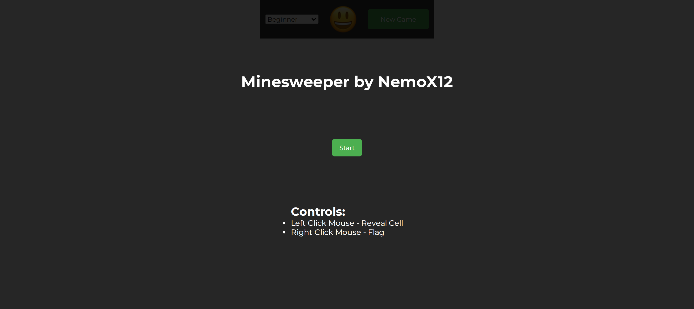
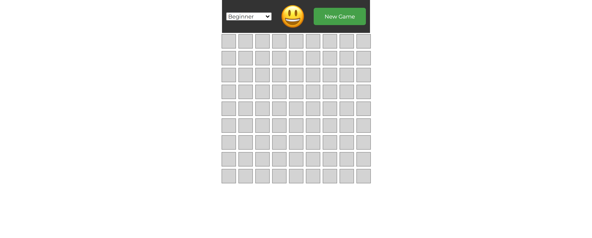

# Minesweeper React App

## Introduction

Welcome to the Minesweeper React App, a classic game built using React. This application allows users to enjoy the timeless challenge of Minesweeper in a modern and user-friendly environment. Minesweeper is a single-player puzzle game where the objective is to clear a rectangular board containing hidden mines without detonating any of them.

## Features

- **Multiple Difficulty Levels:** Choose from beginner, intermediate, and expert difficulty levels, each offering a different grid size and mine count.
- **Flagging System:** Mark potential mine locations by flagging cells, helping you strategize your moves.
- **Dynamic Board Generation:** Experience a new challenge with each game as the board and mine placements are dynamically generated.

## Screenshots

### Modal

### Game Process

## How to Play

1. **Select Difficulty:** Choose your preferred difficulty level from the options provided (beginner, intermediate, or expert).
2. **Start New Game:** Click the "New Game" button to start a new Minesweeper game with the selected difficulty.
3. **Reveal Cells:** Left-click on a cell to reveal its content. If it's a mine, the game ends. If it's a number, it indicates the number of mines adjacent to that cell.
4. **Flag Mines:** Right-click on a cell to flag it as a potential mine. This helps you keep track of locations you suspect may contain mines.
5. **Winning:** Successfully reveal all non-mine cells to win the game.
6. **Losing:** If you reveal a mine, the game ends. You can start a new game to try again.

Enjoy the Minesweeper challenge and have fun strategizing to uncover the hidden mines while avoiding the pitfalls!

## Usage

[Play Minesweeper Now](https://fluffy-mermaid-cda5a1.netlify.app/)

### Or use locally

#### Prequisites:

- Node 16.x+

1. Clone repository on your Device.
2. Download dependencies `npm i`
3. Start project `npm run dev`
